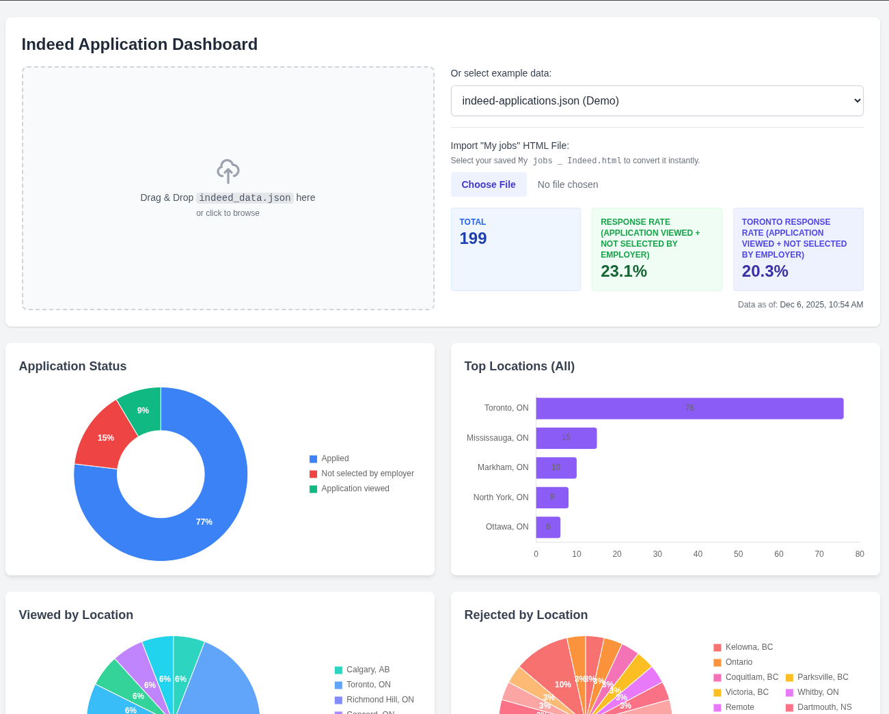
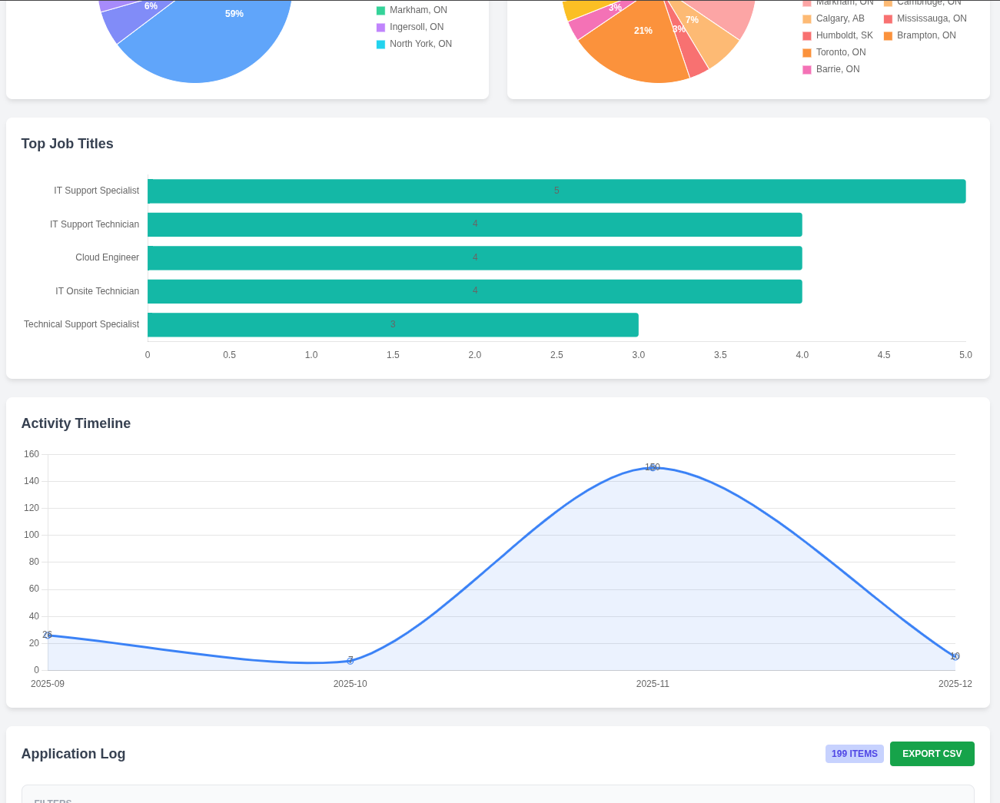

# Indeed Job Application Dashboard

A modern, interactive web dashboard for visualizing and analyzing job application data exported from Indeed. Built with vanilla JavaScript, Chart.js, and Tailwind CSS—no frameworks required.

## 🖼️ Dashboard Preview





## ✨ Features

### 📊 Visual Analytics
- **Interactive Charts**: Doughnut, bar, and line charts powered by Chart.js
- **Status Distribution**: See application outcomes at a glance
- **Geographic Analysis**: Top 5 locations where you're applying
- **Job Title Trends**: Most common positions you're targeting
- **Timeline View**: Monthly application activity tracker

### 📋 Smart Application Log
- **Multi-Column Filtering**: Filter by date range, status, job title, and company
- **Dynamic Sorting**: Click any column header to sort
- **Pagination**: Navigate through 10 entries at a time
- **Color-Coded Badges**: Visual status indicators (Applied, Viewed, Not Selected)
- **CSV Export**: Download filtered data for external analysis

### 📱 Responsive Design
- **Mobile-Optimized**: Card-based view on smaller screens
- **Drag & Drop**: Upload your JSON files with ease
- **Real-Time Updates**: Instant feedback on all interactions

## 🚀 Quick Start

### Prerequisites
- Modern web browser (Chrome 90+, Firefox 88+, Safari 14+, Edge 90+)
- Python 3.x **OR** Node.js (for local server)
- BeautifulSoup4 (for data extraction): `pip install beautifulsoup4`

### Step 1: Extract Your Indeed Application Data

Before using the dashboard, you need to export your application history from Indeed:

1. **Log into Indeed**
   - Navigate to [indeed.com](https://www.indeed.com) and sign in to your account

2. **Go to Your "Applied" Page**
   - Navigate directly to [myjobs.indeed.com/applied](https://myjobs.indeed.com/applied) to see your full application history.

3. **Save the Webpage**
   - Right-click anywhere on the page and select **"Save As..."** (or press `Ctrl+S` / `Cmd+S`)
   - Choose **"Webpage, Complete"** or **"Webpage, HTML Only"** format
   - Save the file as `My jobs _ Indeed.html` (this is the default filename)
   - Save it to the `extract/` folder in this project directory
   
   > **Note**: If the `extract/` folder doesn't exist, create it in the project root:
   > ```bash
   > mkdir extract
   > ```

4. **Run the Extraction Script**
   ```bash
   cd scripts
   python3 extract_indeed_html.py
   ```
   
   The script will:
   - Locate your saved HTML file
   - Parse all job application entries
   - Extract job titles, companies, locations, statuses, and dates
   - Generate a JSON file at `data/indeed-applications.json`
   - Display a success message with the number of applications extracted

5. **Verify the Output**
   - Check that `data/indeed-applications.json` was created
   - The file should contain all your application data in structured JSON format

> **Troubleshooting**: If the script can't find your HTML file, it will show you the paths it checked. Make sure the file is named correctly and placed in one of these locations:
> - `extract/My jobs _ Indeed.html` (recommended)
> - `My jobs _ Indeed.html` (project root)
> - `data/My jobs _ Indeed.html`

### Step 2: Installation

1. **Clone the repository**
   ```bash
   git clone https://github.com/yourusername/indeed-data-dashboard.git
   cd indeed-data-dashboard
   ```

2. **Start a local server**

   > ⚠️ **Important**: You must use a local server due to browser CORS restrictions. Opening `index.html` directly will not work.

   **Option A: Python (Recommended)**
   ```bash
   cd src
   python3 -m http.server 8000
   ```
   Then navigate to: `http://localhost:8000`

   **Option B: Node.js**
   ```bash
   npx http-server src -p 8000 -c-1
   ```
   Then navigate to: `http://localhost:8000`

   **Option C: npm script**
   ```bash
   npm run dev
   ```

3. **Load your data**
   - The dashboard will automatically load `indeed-applications.json` by default
   - Or drag and drop your JSON file into the drop zone
   - Or use the dropdown to select example data files

> **Note on Tailwind CDN**: This project uses the Tailwind CSS CDN for simplicity and ease of setup. While the browser console may show a warning about production use, this is perfectly fine for personal projects and local development. The CDN warning does not affect functionality. For production deployments, you may want to install Tailwind CSS locally using npm and build the CSS file. See the [Production Deployment](#-production-deployment) section for details.

## 📂 Project Structure

```
indeed-data-dashboard/
├── extract/                        # Place your saved Indeed HTML files here
│   └── My jobs _ Indeed.html       # (You create this by saving Indeed page)
├── data/
│   ├── indeed-applications.json    # Generated by extraction script
│   └── example.json                # Sample data (1 entry)
├── scripts/
│   ├── extract_indeed_html.py      # ⭐ Extract data from Indeed HTML
│   ├── fix_json.py                 # JSON syntax repair utility
│   └── clean_json.py               # Data cleaning utility
├── src/
│   ├── index.html                  # Main dashboard interface
│   ├── app.js                      # Application orchestration
│   ├── style.css                   # Custom styles
│   └── js/
│       ├── api.js                  # Data fetching & error handling
│       ├── charts.js               # Chart.js visualizations
│       └── table.js                # Table logic & CSV export
├── package.json                    # Project metadata
├── LICENSE                         # MIT License
└── README.md                       # This file
```

## 📊 Data Format

Your JSON file should follow this structure:

```json
{
  "meta": {
    "export_date": "2025-12-01",
    "source": "Indeed Application History",
    "total_entries": 189,
    "creation_timestamp": "2025-12-01T22:05:26.434798"
  },
  "applications": [
    {
      "id": 1,
      "title": "Software Engineer",
      "company": "Tech Corp",
      "location": "Toronto, ON",
      "status": "Applied",
      "date_applied": "2025-12-01"
    }
  ]
}
```

### Supported Status Values
The extraction script automatically detects various Indeed status formats:
- `Applied` - Initial submission (green badge)
- `Application viewed` - Employer viewed application (blue badge)
- `Not selected by employer` - Rejected (red badge)
- `Interview` - Interview scheduled (purple badge)
- `Offer` - Job offer received (yellow badge)
- Custom statuses supported (gray badge)

## 🎨 Technology Stack

| Component | Technology | Version |
|-----------|-----------|---------|
| Core | Vanilla JavaScript (ES6 Modules) | Native |
| Styling | Tailwind CSS | 3.x (CDN) |
| Charts | Chart.js | 4.4.1 |
| Plugins | chartjs-plugin-datalabels | 2.0.0 |
| Server | Python http.server / Node.js | - |
| Extraction | BeautifulSoup4 | Latest |

## 🔧 Utility Scripts

### Extract Indeed Application Data
**`extract_indeed_html.py`** - Automatically parses saved Indeed HTML pages:
```bash
cd scripts
python3 extract_indeed_html.py
```
Features:
- Intelligent date parsing (handles "today", "yesterday", "Sep 16", day names)
- Automatic field detection (title, company, location, status)
- Fallback logic for missing data
- Creates timestamped JSON output

### Repair JSON Syntax Errors
**`fix_json.py`** - Removes trailing commas and validates structure:
```bash
cd scripts
python3 fix_json.py
```

### Clean Application Data
**`clean_json.py`** - Removes unnecessary fields (`original_date_text`, `sub_status`):
```bash
cd scripts
python3 clean_json.py
# or
npm run clean
```

## 💡 Key Features Explained

### Response Rate Calculation
```
Response Rate = (Non-"Applied" statuses / Total Applications) × 100
```
Any status other than "Applied" counts as a response from the employer.

### Monthly Timeline Aggregation
Applications are automatically grouped by month (YYYY-MM format) to reveal trends and identify high-activity periods.

### CSV Export
- Exports currently filtered/sorted data
- Includes all fields (ID, Title, Company, Location, Status, Date)
- Properly escapes quotes and commas
- Downloads as `indeed_applications_export.csv`

### Pagination System
- Displays 10 entries per page
- Maintains filter/sort state across pages
- Updates counters dynamically
- Disables navigation buttons at boundaries

## 🚢 Production Deployment

If you want to deploy this dashboard to production and eliminate the Tailwind CDN warning:

1. **Install Tailwind CSS locally**:
   ```bash
   npm install -D tailwindcss
   npx tailwindcss init
   ```

2. **Create a `tailwind.config.js`**:
   ```js
   module.exports = {
     content: ["./src/**/*.{html,js}"],
     theme: { extend: {} },
     plugins: [],
   }
   ```

3. **Create an input CSS file** (`src/input.css`):
   ```css
   @tailwind base;
   @tailwind components;
   @tailwind utilities;
   
   body { font-family: 'Inter', sans-serif; background-color: #f3f4f6; }
   .card { background: white; border-radius: 8px; box-shadow: 0 4px 6px -1px rgba(0, 0, 0, 0.1); padding: 20px; }
   /* Add your custom styles here */
   ```

4. **Build the CSS**:
   ```bash
   npx tailwindcss -i ./src/input.css -o ./src/output.css --watch
   ```

5. **Update `index.html`** to use the built CSS:
   ```html
   <!-- Replace CDN link with: -->
   <link rel="stylesheet" href="output.css">
   ```

For most personal use cases, the CDN version works perfectly fine!

## 🧪 Testing

This project uses [Jest](https://jestjs.io/) for unit and integration testing. The tests are located in the `tests/` directory and are configured to run in a Node.js environment.

### Running Tests

To run the entire test suite once, use the following command:

```bash
npm test
```

### Watch Mode

For interactive development, you can run tests in watch mode. This will automatically re-run tests whenever a file is changed:

```bash
npm test:watch
```

### Test Coverage

To generate a report of how much code is covered by the test suite, run:

```bash
npm run test:coverage
```

This will create a `coverage/` directory with an HTML report that you can view in your browser.

## 🐛 Troubleshooting

### Extraction Script Issues
- ✅ **"BeautifulSoup4 not installed"**: Run `pip install beautifulsoup4`
- ✅ **"Could not find HTML file"**: Check the file is saved in the `extract/` folder with the correct name
- ✅ **Incorrect dates extracted**: The script handles relative dates automatically. If dates seem wrong, verify your system date is correct
- ✅ **Missing job titles/companies**: Ensure you saved the complete webpage (not just HTML only)

### Dashboard won't load
- ✅ Ensure you're using a local server (not `file://` protocol)
- ✅ Check browser console for errors (F12)
- ✅ Verify JSON syntax with `python3 scripts/fix_json.py`

### Charts not displaying
- ✅ Verify Chart.js CDN is accessible
- ✅ Check for JavaScript errors in browser console
- ✅ Clear browser cache and reload page

### Export not working
- ✅ Ensure JavaScript is enabled in your browser
- ✅ Check browser's download permissions
- ✅ Verify data exists in the filtered view

### Filters seem stuck
- ✅ Clear all filter inputs to reset
- ✅ Reload the page (F5)
- ✅ Confirm data file loaded successfully

## 💼 Use Cases

### For Job Seekers
- **Track Progress**: Monitor application volume and response rates over time
- **Identify Patterns**: Discover which job titles and locations you're targeting most
- **Measure Success**: Calculate your response rate to optimize your strategy
- **Export Data**: Analyze trends in Excel, Google Sheets, or other tools
- **Stay Organized**: Keep all application data in one place with regular exports

### For Career Coaches
- **Client Analysis**: Review client application strategies
- **Performance Metrics**: Track improvements over time
- **Custom Reports**: Export filtered data for presentations

### For Developers
- **Learning Project**: Study modern JavaScript ES6 module patterns
- **Extend Features**: Add new visualizations or filtering logic
- **Data Integration**: Connect to other job tracking systems
- **Web Scraping Practice**: Learn HTML parsing with BeautifulSoup

## 🔐 Privacy & Security

- ✅ **100% Client-Side**: All data processing happens in your browser
- ✅ **No Server Uploads**: Your data never leaves your computer
- ✅ **No Tracking**: No analytics or third-party scripts
- ✅ **Open Source**: Full transparency—review the code yourself
- ✅ **Local Storage Only**: Extracted data stays on your machine

## 🤝 Contributing

Contributions are welcome! Here are some areas for improvement:

**High Priority:**
- [ ] Add date range presets (Last 7 days, Last month, etc.)
- [ ] Implement advanced search with regex support
- [ ] Add dark mode toggle
- [ ] Create PDF export functionality
- [ ] Auto-refresh from Indeed (browser extension)

**Medium Priority:**
- [ ] Support CSV/Excel file imports (in addition to JSON)
- [ ] Add more chart types (scatter plots, heatmaps)
- [ ] Implement virtual scrolling for large datasets (1000+ entries)
- [ ] Add data validation with user-friendly error messages
- [ ] Company reputation integration

**Nice to Have:**
- [ ] Multi-language support (i18n)
- [ ] Custom color themes
- [ ] Save filter preferences to browser storage
- [ ] Application comparison tool
- [ ] Automated Indeed extraction (scheduled)

### How to Contribute

1. Fork the repository
2. Create a feature branch (`git checkout -b feature/AmazingFeature`)
3. Commit your changes (`git commit -m 'Add AmazingFeature'`)
4. Push to the branch (`git push origin feature/AmazingFeature`)
5. Open a Pull Request

## 📄 License

This project is licensed under the MIT License - see the [LICENSE](LICENSE) file for details.

## 🌟 Acknowledgments

- **Chart.js** - Beautiful JavaScript charting library
- **Tailwind CSS** - Utility-first CSS framework
- **BeautifulSoup** - Python HTML parsing library
- **Indeed** - Inspiration from their application tracking system
- **Community** - All contributors and users providing feedback

## 📧 Support

Having issues or questions?

1. Check the [Troubleshooting](#-troubleshooting) section
2. Review the browser console for error messages (F12)
3. Ensure all prerequisites are met
4. Verify the extraction script ran successfully
5. Open an issue on GitHub with details

---

**Built with ❤️ for job seekers navigating their career journey**

*Star this repo if you find it helpful! ⭐*